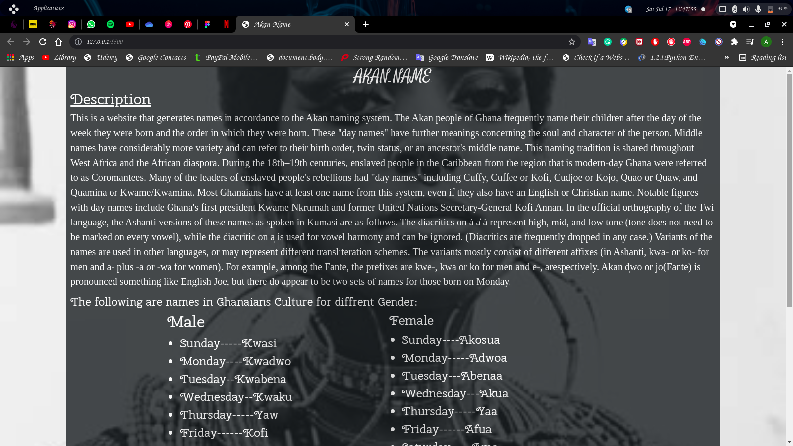
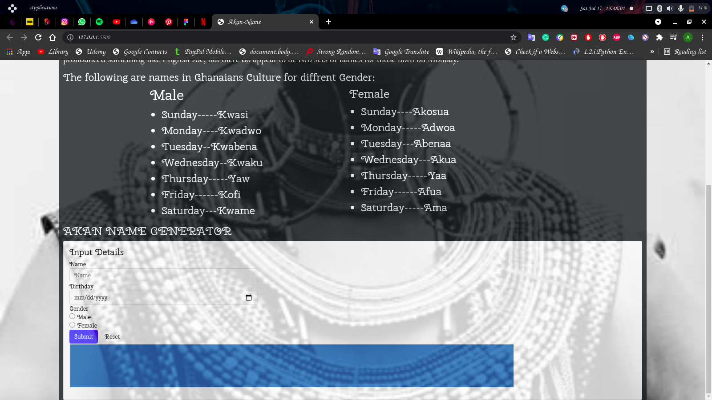

# Hello👋, I’m Anthony
# AKAN NAME
---
### Project created by Anthony Mutuku
---
## Project Description
---
#### This is a website that generates your name in accordance with the Ghanaian Culture of the Akan people who named people in accordance with the Akan Naming system.

---
## Languages Used
---
### *HTML*
### *CSS*
### *BOOTSTRAP*
### *JAVASCRIPT*
---
***
# BDD
---

1. Displays Form For Entering Name, Date and Gender.
   - INPUT: "User Name
   - INPUT: "Users BirthDate in format mm/dd/yyyy"
   - INPUT: "User's Gender Entered"
   - OUTPUT: "Displays User's Name together with his Akan Name"
2. Displays an Error Message if Date Input Left Blank
   - INPUT: ""
   - OUTPUT: "Displays Error Message"
3. Displays an Error Message if Gender Not Chosen
   - INPUT: ""
   - OUTPUT: "Display an Error Message"
4. Clears Form and Reset the Message on Click
   - INPUT: "Click Reset Button"
   - OUTPUT: "Clears and Resets the Form"
   ---
   ***
## Setup Instructions and Installation

- Clone the repository to a directory in you computer. Link to repo https://anthony64m.github.io/Akan-Name/
- Git init, git clone https://anthony64m.github.io/Akan-Name/
- Open terminal command line then navigate to the directory and open your using your favorite text editor.
- Open `index.html` on your Browser.

### Installation Medium
1. Steady Network.
2. Weblink
3. Github account.
---
***
### Known Bugs
### Currently no bugs experienced in the making of the  project if there are in th future kindly inform me.
---
***
### Product Screenshot

***
---
### Link to Project
https://anthony64m.github.io/Akan-Name/
***
---
### Contact Me
#### anthony.mutuku@students.moringaschool.com
#### anthony64m.github.io
---
***
### LICENSE
### copyright@2021©Anthony	